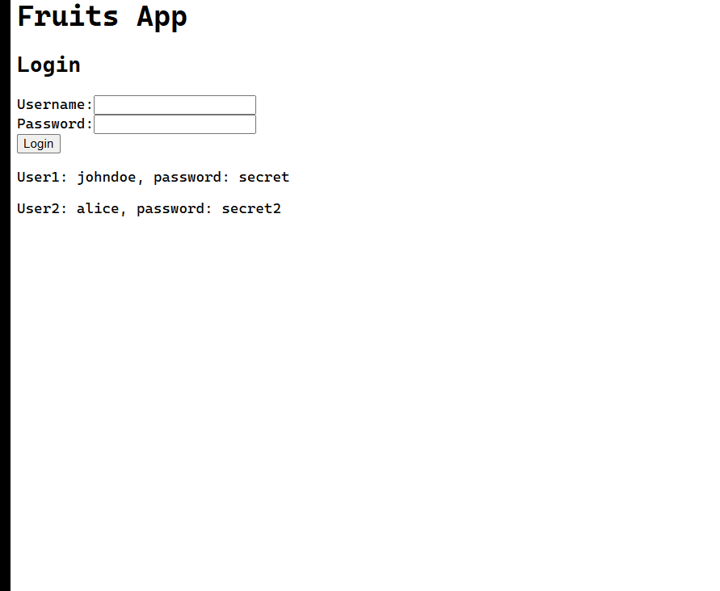

# Fruits App - React + FastAPI



## How To Use It

```bash
git clone git@github.com:fagnerpereira/react-fastapi-example.git
```

- Enter into the new directory:

```bash
cd react-fastapi-example
```

- Run the app using Docker Compose (recommended):

```bash
./startup.sh
```

- Run the app without Docker Compose:

For the backend:

```bash
cd backend
```

- install uv:

```bash
# On macOS and Linux.
curl -LsSf https://astral.sh/uv/install.sh | sh
```

```bash
# On Windows.
powershell -ExecutionPolicy ByPass -c "irm https://astral.sh/uv/install.ps1 | iex"
```

- install dependencies:

```bash
uv sync
```

- run the app:

```bash
fastapi dev app/main.py
```

For the frontend:

```bash
cd frontend
```

- install dependencies:

```bash
npm install
```

- run the app:

```bash
npm run dev
```

## TODO

- [x] Create basic structure
- [x] Create Fruits CRUD
- [x] Integrate frontend with backend
- [x] Add tests
- [x] Add authentication
- [x] Configure Docker for development
- [ ] Configure Docker for production
- [ ] Add deployment using Kamal
- [x] Improve backend code organization
- [x] Improve frontend code organization
- [x] Improve readme
- [ ] Configure JWT
- [ ] Configure Sqlite database
